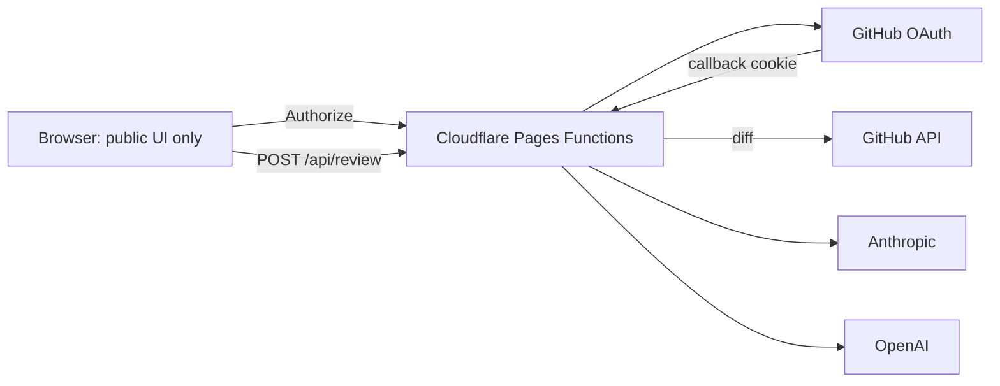

# PR Review

A GitHub pull request reviewer powered by **Claude** or **OpenAI**.

The UI is static. The review prompt, GitHub diff fetch, and model calls run in a **Cloudflare Worker**, so visitors cannot read that code in the browser.

## Why Cloudflare Pages (not Netlify, Vercel, or GitHub Pages)

| | Cloudflare Pages | Netlify | Vercel | GitHub Pages |
| --- | --- | --- | --- | --- |
| Hide review prompt from the browser | Functions, same deploy | Functions (Lambda) | Serverless | No backend |
| GitHub OAuth + HttpOnly cookie | Native | Extra setup | Extra setup | Not possible alone |
| Cold starts | Almost none | AWS Lambda | Often fine | n/a |
| Fits this repo | `functions/` already here | Would rewrite | Would rewrite | UI only, all JS public |

Use **Cloudflare Pages**. One project serves `public/` and `functions/`.

**Honest limit:** site visitors will not see `lib/` or `functions/` in DevTools. Anyone with access to this **git repository** still can. Make the GitHub repo **private** if the prompt and server code must stay secret.

## Architecture



## Local development

```bash
cp .dev.vars.example .dev.vars
# fill GITHUB_CLIENT_ID / GITHUB_CLIENT_SECRET (and optional AI keys)
npx wrangler dev --port 4173
npm test
```

Open http://127.0.0.1:4173. Plain `python3 -m http.server` will not run `/api/*`.

GitHub OAuth App callback for local: `http://127.0.0.1:4173/api/oauth/callback`.

## Deploy on Cloudflare

This is **not** caused by a missing GitHub client ID or secret. Those are used after the site is live. The build failed because Cloudflare runs `npx wrangler deploy`, which needs `main` and `[assets]` in `wrangler.toml` (now in this repo).

1. **Commit and push** this repo to `bits-of-ai/pr-review` (including `src/index.js` and the updated `wrangler.toml`).
2. In Cloudflare, keep **Deploy command** as `npx wrangler deploy` if that is already set.
3. Retry the deployment. It should succeed without GitHub OAuth secrets.
4. After the site is up, add environment variables (see below), then create the GitHub OAuth App using the live URL.

[Register a GitHub OAuth App](https://github.com/settings/applications/new):

- Homepage URL: `https://<project>.pages.dev` or your `*.workers.dev` URL
- Authorization callback URL: `https://<same-host>/api/oauth/callback`

5. After deploy, **Settings → Variables and Secrets** (Production):

| Name | Secret? | Purpose |
| --- | --- | --- |
| `GITHUB_CLIENT_ID` | no | OAuth App client ID |
| `GITHUB_CLIENT_SECRET` | **yes** | OAuth App secret |
| `OAUTH_SCOPE` | no | default `repo read:user` |
| `ANTHROPIC_API_KEY` | **yes** | optional hosted Claude key |
| `OPENAI_API_KEY` | **yes** | optional hosted OpenAI key |

CLI equivalent:

```bash
npx wrangler secret put GITHUB_CLIENT_SECRET
npx wrangler secret put ANTHROPIC_API_KEY
```

Put `GITHUB_CLIENT_ID` in `[vars]` in `wrangler.toml` or in the dashboard.

6. Add the production callback URL on the GitHub OAuth App if you use a custom domain.

Until OAuth secrets exist, **Authorize with GitHub** stays disabled. Users can paste a `repo`-scoped PAT. If you set a hosted AI key, reviewers do not need to paste one.

## Using the app

1. Authorize with GitHub (or paste a PAT — it is stored in an HttpOnly cookie, not `localStorage`).
2. Paste a PR URL or fill repository + number.
3. Optional extra context.
4. Choose Claude or OpenAI (and an API key if the host did not set one).
5. Review. Copy Markdown or comment on the PR.

## Project layout

```
public/             what the browser can download
src/index.js        Worker: API routes + static assets
functions/api/      route handlers used by the Worker
lib/                review prompt, GitHub, AI — not served as static files
tests/
wrangler.toml
```

## Contributing

See [CONTRIBUTING.md](CONTRIBUTING.md).

## License

[MIT](LICENSE)
